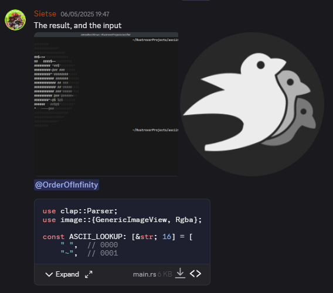
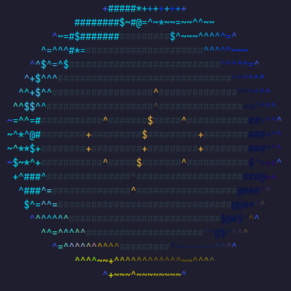

# Image to ASCII

> **This quest is heavily inspired by a user from the `rustfully discord server`.**
>   
> _I dont know if this is right to have his screenshot here without permission._

The `main.rs` file contains all the code.

I tried to comment the code as much as possible. Feel free to suggest something in the issues or discussions.  
_(although this repo is meant just for fun and experimenting with random stuff. Don't get too serious with the code.)_

Here is a demo output for my profile picture.

| original image                                                   | ascii-fied version                                            |
|------------------------------------------------------------------|---------------------------------------------------------------|
|  |  |